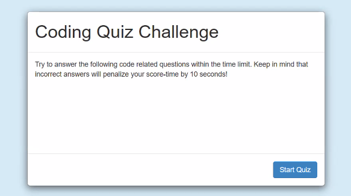
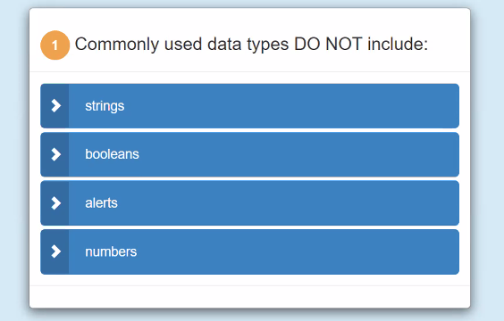

# Web-APIs-Code-Quiz
# 04 Web APIs: Code Quiz

This **project** was assembled to create a timed quiz on JavaScript fundamentals that stores high scores so that user can gauge his/her progress compared to his/her peers. This app runs in the browser and features dynamically updated HTML and CSS powered by a JavaScript code.

## Preview

---

### Website

[Web-APIs-Code-Quiz]

https://sirog-e.github.io/Web-APIs-Code-Quiz/

---

## Description

The criteria given to:
- Once the start button is clicked to start the quiz located in the start page, a 75 second timer starts.
- User is presented with a multiple choice question with 4 option answers.
- Once the user selects and answer, it will evaluate the answer.
- User will receive an alert to show whether answer was correct or wrong.
- User then will be presented with a new question and a new set of answer options.
- If the user answered the question wrong, timer will deduct 10 second to the countdown.
- Once all 5 questions are answered or timer reaches 0, the quiz has ended. 
- User will be displayed his score and will be asked to enter his/her initials.
- Then user will be displayed a Highscore page where he will compare his/her score to other users or compare his own scores if taken more than one time.
- User will also find a go back button to restart quiz, or a clear highscores button to clear all submitted quizzes. 

## Review

After completing this application, I was able to build a quiz to test code knowledge and tried to the best of my abilities to feature a clean and polished user interface and to create a responsive app.

To complete this project I got help from several sites listed below:

* https://getbootstrap.com/
* https://jsfiddle.net/
* https://www.w3schools.com/

